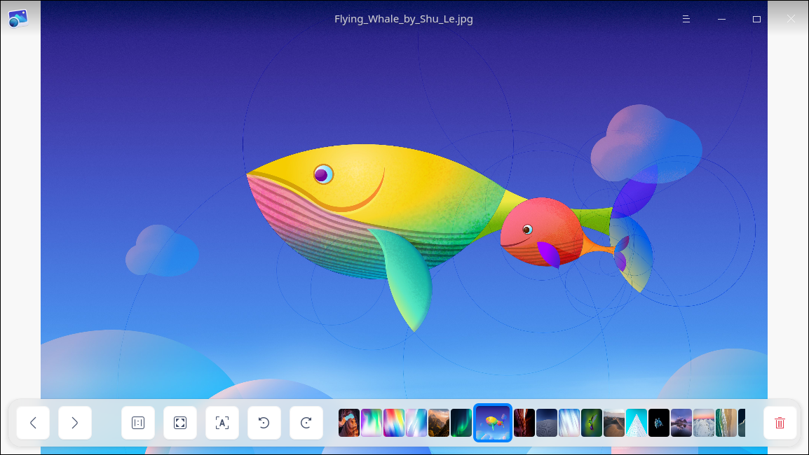
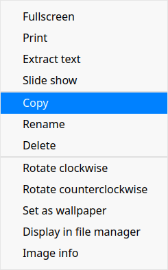
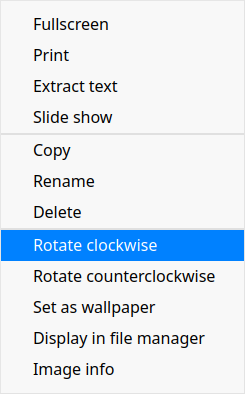
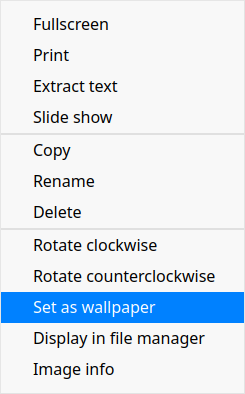
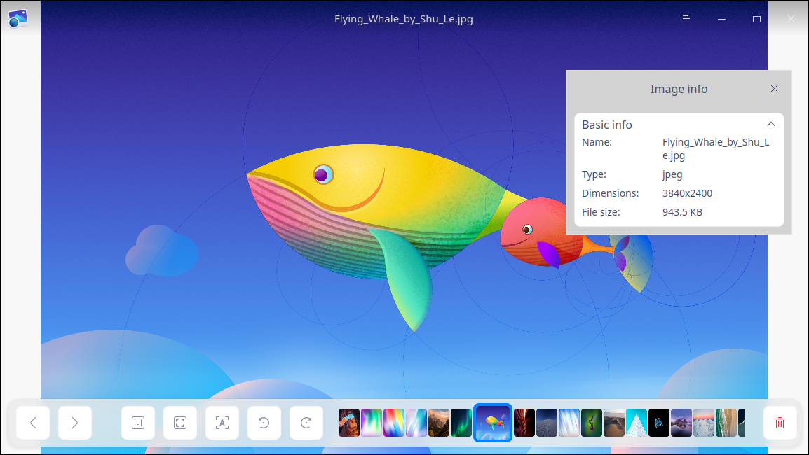

# Image Viewer|deepin-image-viewer|

## Overview

Image Viewer is a lightweight image viewer with a trendy look and smooth performance. Supporting a wide range of image formats, it's more than just easy to use. 

## Guide

You can run, close, and create shortcuts for Image Viewer in the following ways.

### Run Image Viewer

1. Click the Launcher icon  in the Dock to enter the Launcher interface.
2. Locate Image Viewer  by scrolling the mouse wheel or searching "image viewer" in the Launcher interface.
3. Right-click  and the user can:
 - Click **Send to desktop** to create a desktop shortcut.
 - Click **Send to dock** to fix the application in the Dock.
 - Click **Add to startup** to add the application to startup, and it will automatically run when the system starts up.

### Exit Image Viewer

- On the Image Viewer interface, click  to exit Image Viewer.
- Right-click  in the Dock and select **Close All** to exit Image Viewer.
- Click  on the Image Viewer interface and select **Exit** to exit Image Viewer.

### View Shortcuts 

On the Image Viewer interface, press **Ctrl + Shift + ?** on the keyboard to view shortcuts. 

## Image Viewing

### Open Images

You can use one of the following ways to open image files:

- Right-click an image and select **Open with** > **Image Viewer**. 
- Double-click an image to open if Image Viewer has been set as the default application for image viewing.
- Open Image Viewer, click **Open Image** and select the image file to open it.
- Open Image Viewer and drag the image to the interface to open it.
- Drag the image to the Image Viewer icon on the desktop or in the Dock to open it.

>  Tips: In Control Center, you can set Image Viewer as the default image viewer. Please refer to [Default Applications](dman:///dde#Default Applications) for specific operations.

Following Image formats are supported: BMP, ICO, JPG/JPE/JPEG, PNG, TGA, TIF/TIFF, XPM, GIF, WEBP, CR2, NEF, DNG, RAF, MEF, MRW, XBM, SVG, ORF, MNG, etc.

### Main Interface

| Icon                                                   | Name                    | Description                                               |
| ------------------------------------------------------ | ----------------------- | --------------------------------------------------------- |
|                     | Previous                | Switch to the previous image.                             |
|                             | Next                    | Switch to the next image.                                 |
|                | 1:1 Size                | The image will show in 1:1 size.                          |
|                 | Fit to window           | The image will be resized to adapt to the current window. |
|                 | Extract text          | Texts on the image will be recognized. |
|  | Rotate clockwise        | Rotate the image 90 degrees clockwise.                    |
|             | Rotate counterclockwise | Rotate the image 90 degrees counterclockwise.             |
|                         | Delete                  | Delete the current image.                                 |

&nbsp;&nbsp;&nbsp;&nbsp;&nbsp;&nbsp;&nbsp;&nbsp;&nbsp;&nbsp;&nbsp;&nbsp;&nbsp;
>  Tips: If the image size exceeds the window, a navigation window will appear at the lower left corner of the interface, which helps you fast locate image areas. If you don't want to show the navigation window automatically, you can close it by clicking  at the top right corner of the window. You can right-click to select **Hide/Show navigation window** on the Image Viewer interface.

>  Notes: The Rotate and Delete icons are grayed out and disabled for system images.

### Print Images

1. Right-click the image on the Image Viewer interface and select **Print**.
2. Select the printer and set the printing parameters.
3. Click **Print**.

>  Notes: Click **Advanced** to customize the printing parameters.

### Extract Texts

1. Click on the tool-bar or right-click to select **Extract text** on the Image Viewer interface to enter the text extraction interface and extract the texts on the image.

2. You are able to edit the recognized texts in the text area in the right column. Click the  icon on the lower right corner to copy the texts recognized to the clipboard and click the  icon to save the texts recognized as TXT .

   

### Rename Images

1. Right-click the image on the Image Viewer interface and select **Rename**.
2. Input a new name in the pop-up window.
3. Click **Confirm** to rename the image.

>  Notes: System images can not be renamed.

### Show in slides

1. Right-click the image on the Image Viewer interface.
2. Select **Slide show** and all images will be played as slides in full screen. 
3. Press the **Esc** key to exit slide show.

### Copy Images

1. Right-click the image on the Image Viewer interface and select **Copy**.
2. On the desktop or in the target place, right-click the blank area and select **Paste** to copy the image to that location.

### Rotate Images

1. Right-click the image on the Image Viewer interface and select **Rotate clockwise** or **Rotate counterclockwise**.
2. The image will be rotated clockwise or counterclockwise for 90 degrees.

### Set as Wallpaper

You can set an image as desktop wallpaper. Right-click the image on the Image Viewer interface and select **Set as wallpaper**.

### Display in File Manager

1. Right-click the image in the Image Viewer interface and select **Display in file manager**.
2. The folder contained the image will be opened and displayed.

### View Image Information

You can view detailed information of the image.
1. Right-click the image in the Image Viewer interface and select **Image info**.
2. The image info window will pop up displaying the detailed information of the Image.

### Delete Images

You can delete images from Image Viewer in the following ways.

- Click the  icon on the Image Viewer interface. 
- Right-click the image and select **Delete**.
- Press the **Delete** key on the keyboard on the Image View interface.

## Main Menu

In the main menu, you can switch window themes, view help manual, and get more information about Image Viewer.

### Theme

The window theme provides three theme types, namely Light Theme, Dark Theme, and System Theme.

1. On the Image Viewer interface, click .
2. Click **Theme** to select one theme.

### Help
1. On the Image Viewer interface, click .
2. Click **Help** to view the manual of Image Viewer.

### About

1. On the Image Viewer interface, click .
2. Click **About** to view the version and introduction of Image Viewer.

### Exit

1. On the Image Viewer interface, click .
2. Click **Exit** to exit Image Viewer.