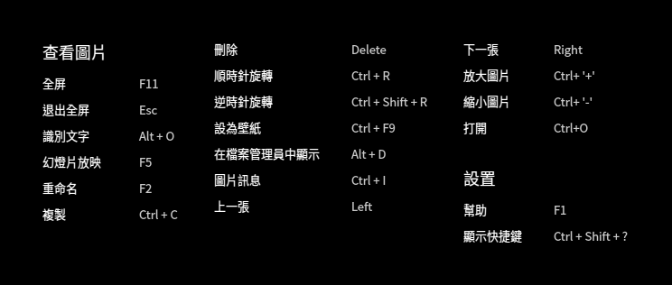
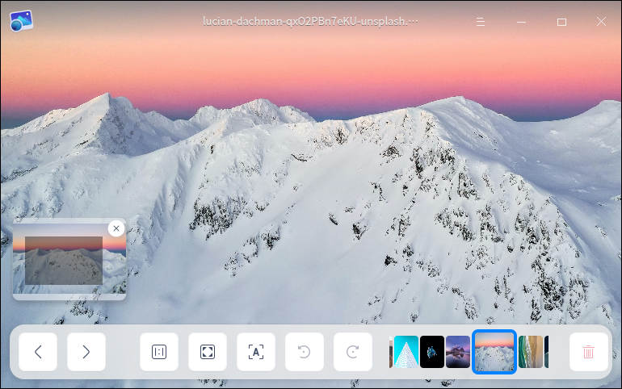
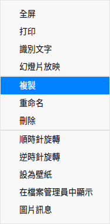
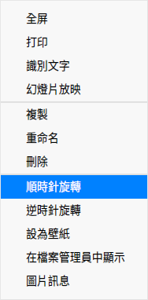
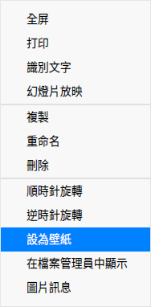
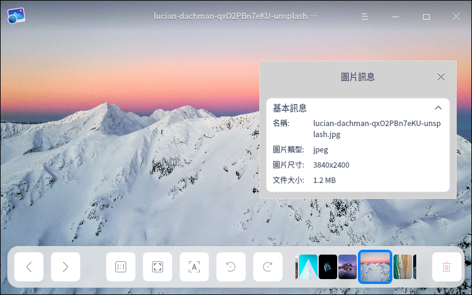

# 看圖|deepin-image-viewer|

## 概述

看圖是一款小巧的圖片查看應用軟件。外觀時尚、性能流暢，支持多種圖片格式，隨時想看就看，實用又快捷。

## 使用入門

通過以下方式運行或關閉看圖，或者創建看圖的快捷方式。

### 運行看圖

1. 單擊任務欄上的啟動器圖標 ，進入啟動器界面。
2. 上下滾動鼠標滾輪瀏覽或通過搜索，找到看圖圖標 ，單擊運行。
3. 右鍵單擊 ，您可以：
 - 單擊 **傳送到桌面**，在桌面創建快捷方式。
 - 單擊 **傳送到任務欄**，將應用程序固定到任務欄。
 - 單擊 **加至開機啟動**，將應用程序添加到開機啟動項，在電腦開機時自動運行該應用。

### 關閉看圖

- 在看圖界面單擊 ，退出看圖。
- 在任務欄右鍵單擊 ，選擇 **關閉所有**，退出看圖。
- 在看圖界面單擊 ，選擇 **退出**，退出看圖。

### 查看快捷鍵

在看圖界面，使用快捷鍵 **Ctrl + Shift + ?** 打開快捷鍵預覽界面。熟練地使用快捷鍵，將大大提升您的操作效率。

## 圖片查看

### 打開圖片
採用以下任一方式打開圖片。
- 右鍵單擊圖片，選擇用看圖工具打開圖片。
- 設置看圖為默認的圖片查看程序後，可雙擊圖片打開。
- 運行看圖後，單擊 **打開圖片**，選擇文件打開。
- 運行看圖後，拖動圖片到看圖界面，打開圖片。
- 直接拖動圖片到看圖的圖標上。

> 竅門：您可以在控制中心中將看圖設置為默認的圖片查看程序，具體操作請參閱 [默認程序設置](dman:///dde#默認程序設置)。

圖片支持的格式BMP、ICO、JPG/JPE/JPEG、PNG、TGA、TIF/TIFF、XPM、GIF、WEBP、CR2、NEF、DNG、RAF、MEF、MRW、XBM、SVG、ORF、MNG。

### 界面介紹

| 圖標                                                   | 名稱       | 說明                   |
| ------------------------------------------------------ | ---------- | ---------------------- |
|                     | 上一張     | 顯示上一張圖片。       |
|                             | 下一張     | 顯示下一張圖片。       |
|                | 1:1視圖    | 圖片按照實際尺寸顯示。 |
|              | 適應窗口   | 圖片適應窗口尺寸顯示。 |
|              | 識別文字 | 識別圖片中的文字。 |
|  | 順時針旋轉 | 圖片順時針旋轉90度。   |
|             | 逆時針旋轉 | 圖片逆時針旋轉90度。   |
|                         | 刪除       | 刪除當前圖片。         |

> 說明：如果打開的是系統圖片，旋轉功能、刪除圖標處於置灰狀態，即不能使用該操作。

### 顯示/隱藏導航窗口

1. 在看圖界面，單擊工具欄上的按鈕  或滾動鼠標放大圖片且當圖片超出界面範圍時，界面上會出現導航窗口。
2. 拖動導航窗口內的方框，查看該區域的訊息。
3. 單擊導航窗口上的按鈕 **×** 或在右鍵菜單中選擇 **隱藏導航窗口** 來關閉導航窗口。
   
   關閉導航窗口後下次不會再顯示，需在右鍵菜單中選擇 **顯示導航窗口** 來開啟。

### 打印圖片

1. 在看圖界面，單擊鼠標右鍵。
2. 選擇 **打印**。
3. 選擇一個打印機，根據需要設置打印屬性。
4. 選擇 **打印**，將圖片發送到打印機進行打印。

### 識別文字

1. 在看圖界面，單擊工具欄上的按鈕  或右鍵單擊圖片，選擇 **識別文字**，彈出圖文識別窗口，識別圖片中的文字。
4. 單擊右側文本區域可以編輯文字內容；在圖文識別窗口右下角，單擊複製按鈕  將文字內容複製到剪貼板；單擊下載按鈕  將文字內容保存為TXT文件。

### 重命名

1. 在看圖界面，單擊鼠標右鍵。
2. 選擇 **重命名**，
3. 在彈窗內輸入圖片名稱，單擊 **確定** 完成修改。
>說明：系統圖片不支持重命名。

### 幻燈片放映

1. 在看圖界面，單擊鼠標右鍵。
2. 選擇 **幻燈片放映**，圖片將以幻燈片形式全螢幕播放。
3. 按下鍵盤上**Esc** 鍵退出播放。

### 複製圖片

1. 在看圖界面，單擊鼠標右鍵。
2. 選擇 **複製**。
3. 在桌面或者指定位置，單擊鼠標右鍵。
4. 選擇 **黏貼**，將圖片文件複製到該位置。

### 旋轉圖片

1. 在看圖界面，單擊鼠標右鍵。
2. 選擇 **順時針旋轉/逆時針旋轉**。
3. 圖片將會順時針轉旋轉90°/逆時針旋轉90°。

### 設置為壁紙

1. 在看圖界面，單擊鼠標右鍵。
2. 選擇 **設為壁紙**，將當前圖片設置為壁紙。

### 在檔案管理員中顯示
1. 在看圖界面，單擊鼠標右鍵。
2. 選擇 **在檔案管理員中顯示**，定位該圖片的存儲位置。

### 查看圖片訊息

1. 在看圖界面，單擊鼠標右鍵。
2. 選擇 **圖片訊息** ，查看圖片詳細訊息。

### 刪除圖片

在看圖中您可以通過如下方法刪除圖片：

- 單擊工具欄上的圖標 。
- 右鍵單擊圖片，選擇 **刪除**。
- 選擇一張圖片，按下鍵盤上的 **Delete** 鍵。

## 主菜單

在主菜單中，您可以切換窗口主題、查看幫助手冊，了解看圖的更多訊息。

### 主題

窗口主題包含淺色主題、深色主題和系統主題。

1. 在看圖界面，單擊 。
2. 單擊 **主題**，選擇一個主題顏色。

### 幫助

查看幫助手冊，進一步了解和使用看圖。

1. 在看圖界面，單擊 。
2. 單擊 **幫助**。
3. 查看看圖的幫助手冊。

### 關於

1. 在看圖界面，單擊 。
2. 單擊 **關於**。
3. 查看看圖的版本和介紹。

### 退出

1. 在看圖界面，單擊 。
2. 單擊 **退出**。   
